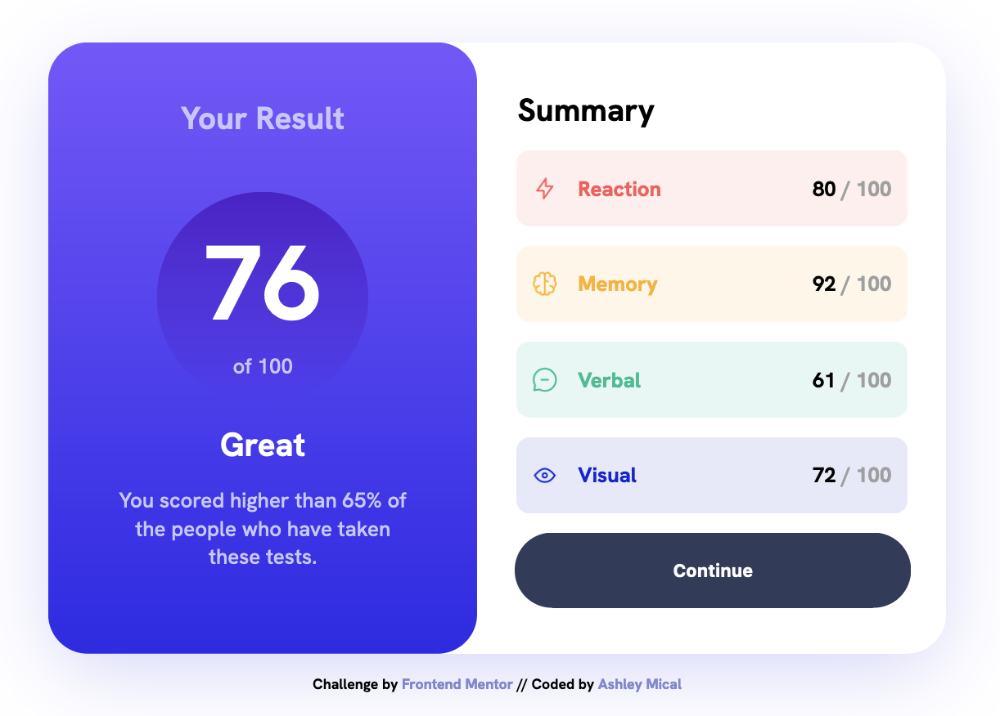

# Frontend Mentor - Results summary component solution

This is a solution to the [Results summary component challenge on Frontend Mentor](https://www.frontendmentor.io/challenges/results-summary-component-CE_K6s0maV). Frontend Mentor challenges help you improve your coding skills by building realistic projects. 

## Table of contents

- [Overview](#overview)
  - [The challenge](#the-challenge)
  - [Screenshot](#screenshot)
  - [Links](#links)
- [My process](#my-process)
  - [Built with](#built-with)
  - [What I learned](#what-i-learned)
  - [Continued development](#continued-development)
- [Author](#author)

## Overview

### The challenge

Users should be able to:

- View the optimal layout for the interface depending on their device's screen size
- See hover and focus states for all interactive elements on the page

### Screenshots

Large Screen:

Small screen:

### Links

- Solution URL: [Add solution URL here](https://github.com/micamash/results-summary-component)
- Live Site URL: [Add live site URL here](https://micamash.github.io/results-summary-component/)

## My process

### Built with

- Semantic HTML5 markup
- CSS custom properties
- Flexbox
- Mobile-first workflow

### What I learned

I continued my HTML/CSS practice with this project. I also practiced my JavaScript skills, but adding the results data from the data.json file.

### Continued development

I am looking forward to improving my HTML semantics and accessibility skills as well as improving my JavaScript skills.

## Author

- [My Github](https://github.com/micamash/)
- Frontend Mentor - [@micamash](https://www.frontendmentor.io/profile/micamash)
